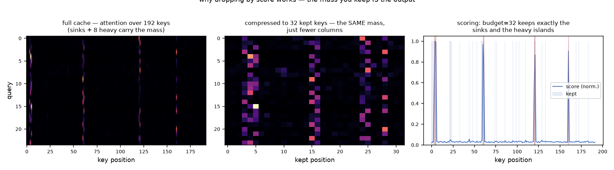
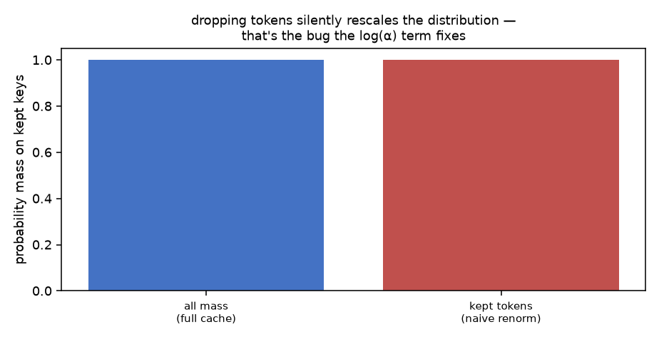
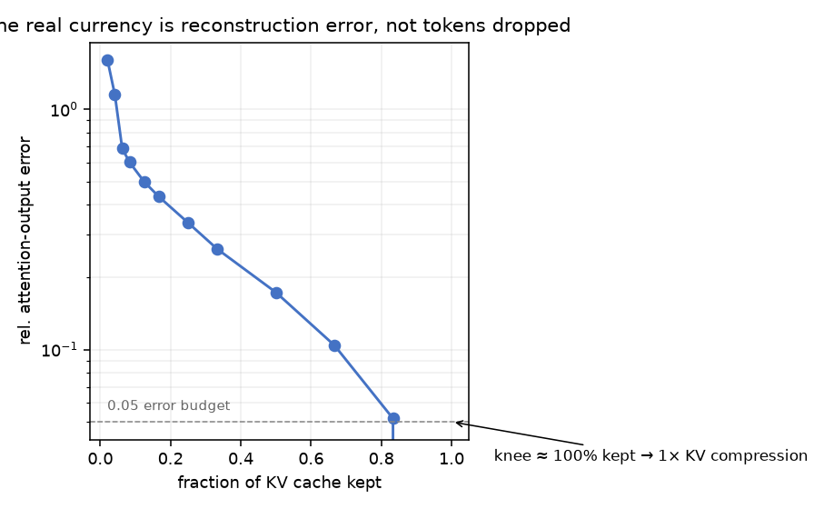

# kvstamp


## The currency of KV eviction is not tokens. It's attention you can still reach.

Every KV-compression paper quotes a keep-ratio. Almost none quote *the error in
the attention output* at that ratio — the only thing downstream layers
experience. kvstamp makes that the primitive: compress the cache, compute the
full-cache output, compare, done. No proxy, no benchmark leaderboard, just
reconstruction error as a function of budget.

## Where the mass actually lives

A 192-key synthetic context with 8 heavy tokens. Attention over the full
cache, then over the compressed cache (budget 32), and the scores that did it:



The panels are not subtly different — the compressed map has the *same mass*,
just fewer columns. Scoring by received-attention finds heavy islands anywhere
in the context; sinks protect the first tokens (RoPE attention's known
pathology).

## The bug nobody flags: silent renormalization

If you drop 80% of the keys and softmax the rest, every kept token just got
~5× more probability — and you never told the model. The `log α` correction
(α = retained mass) is the standard patch; the figure is why it's needed:



## The error curve — the actual API

```python
from kvstamp import reconstruction_error, score_tokens
s = score_tokens(queries, keys)
for budget in (8, 16, 32, 64):
    print(budget, reconstruction_error(queries, keys, values, s, budget=budget))
```



And here's the number that makes the case for measuring instead of quoting
ratios — **identical budget (32/192 keys), different attention structure:**

| context | rel. output error @ budget 32 |
|---|---|
| diffuse (8 heavy tokens, mild peaks) | 0.532 |
| sharp (4 heavy tokens, retrieval-style peaks) | **0.094** |

5.7× error difference at the same keep-ratio. Compression is *exactly* as
lossy as the structure of your attention — retrieval heads and instruction-
following produce the sharp profile, small-talk produces the diffuse one.
`kvstamp`'s API exists so you find out which one you have, per layer, per
head, before you ship a budget. (The demo prints both rows; the test suite
pins the monotonicity that makes the comparison meaningful.)

## Scope and limits

- scores come from real softmax attention over given keys — no surrogate
  heuristic, no accumulated-importance state machine (see the policy angle in
  `pagemem`'s lab for that)
- values are kept at full precision here; V-quantization is orthogonal
- the sinks convention is one hyperparameter (`sinks=4`) exposed, not hidden

Prior art: StreamingLLM (Xiao et al., ICLR 2024) — the α/sink mechanism;
H2O (Zhang et al., NeurIPS 2023) — attention-mass scoring. The reconstruction-
error API is the local contribution.
