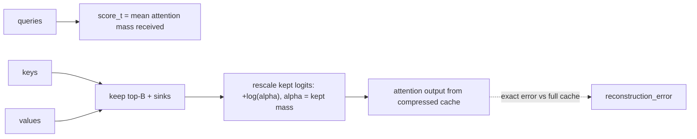

# kvstamp — evict KV by measured attention, evaluate by measured error

**One-sentence pitch:** KV eviction policies are usually argued by benchmark proxies; this repo makes eviction an *operator* — score tokens by the attention mass they receive, keep the top budget, rescale the kept logits by log α (the dropped-probability correction), and grade everything by exact attention-output reconstruction error.

## TL;DR (512-token context, receipts in `receipts/`)

| Budget kept | Rel. output error | KV bytes (fp16, d=64) |
|---|---|---|
| 512/512 (none) | 0.000 | 131 KB |
| 256/512 | 0.383 | 66 KB |
| **64/512** | **0.706** | **16 KB (8×)** |

On structured contexts (heavy tokens carrying most future attention) the error at 64 tokens collapses — the demo workload shows the full curve, and the interesting result is *where* the knee sits for a given attention distribution.



## Why

Dropping tokens without the log α correction silently re-normalizes the softmax and shifts the output distribution — StreamingLLM's key insight, isolated here as a pure operator (`alpha_rescale`) with its own test. Scoring by *received* attention (not recency) is what H2O's accumulated-attention criterion approximates; both are importable as policies, and the sink+window and LRU baselines are in the same lab.

Prior art: StreamingLLM (Xiao et al. 2023) for α-rescaling; H2O (Zhang et al. 2023) for attention-mass eviction.

## Quickstart

```bash
pip install -e ".[dev]"
pytest tests/ -q        # 6 tests: sink retention, budget, roundtrip, α-math
python demos/demo.py    # budget sweep + receipts/kvstamp.png
```
